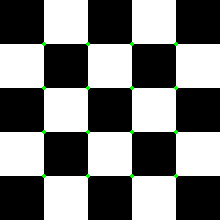

# Harris Corner Detection: Easy Implementation
C++ implementation for Harris Corner Detection algorithm

## Requirements
* OpenCV 2.4

## Implementation
* 根据用户输入路径读入图像，并将图像转换为灰度图像
* 对得到的图像进行Harris角点检测。根据用户输入设定窗口大小，滑动窗口，得到最大特征值矩阵、最小特征值矩阵和R值矩阵
* 将得到的最大特征值矩阵和最小特征值矩阵映射到可视范围内，并对其进行可视化
* 对得到的R值矩阵，将其映射为彩色图像，作为热力图显示
* 设定 Threshold（在此设为R矩阵中最大值的 0.01倍），将R值矩阵中小于Threshold的值全部置为0，并将结果矩阵可视化
* 对Threshold过后得到矩阵进行非最大值抑制，获得局部最大值矩阵
* 将局部最大值矩阵上的局部最大值点标注到原始图像上

## Results

